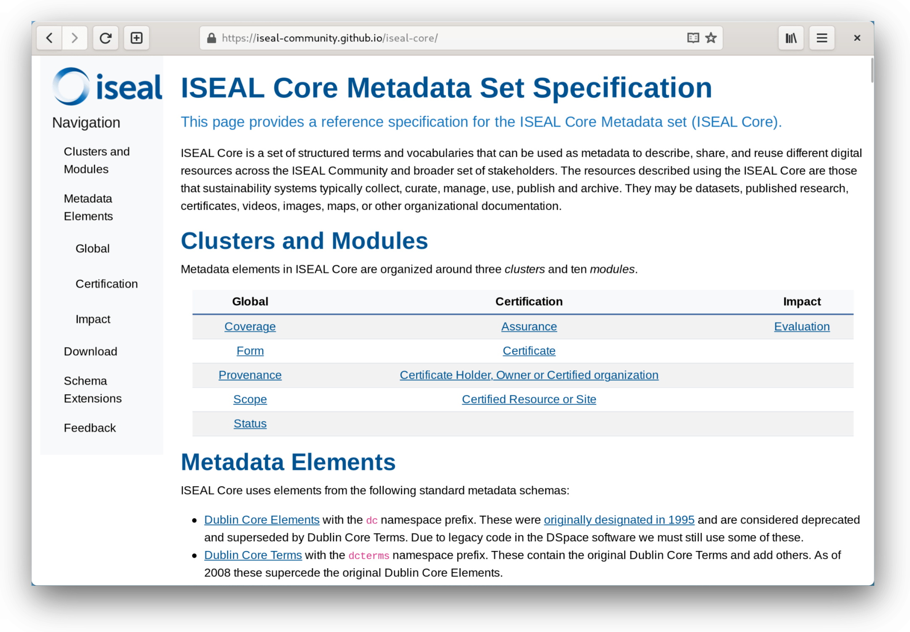

<h1 align="center">ISEAL Core Metadata Set</h1>

  

## About the Project
The ISEAL Core Metadata Set (ISEAL Core) is a set of structured terms and vocabularies that can be used as metadata to describe, share, and reuse different digital resources across the [ISEAL Community](https://www.isealalliance.org/) and broader set of stakeholders. The resources described using the ISEAL Core are those that sustainability systems typically collect, curate, manage, use, publish and archive. They may be datasets, published research, certificates, videos, images, maps, or other organizational documentation.

View the user-friendly schema reference here: https://iseal-community.github.io/iseal-core

## Built With

- [Python](https://python.org/) — used for CSV schema parsing and RDF generation
- [Bootstrap](https://getbootstrap.com/) — used for HTML documentation site style and layout
- [Node.js](https://nodejs.org/) — the Node.js package manager (NPM) installs web dependencies and tooling
- [Hugo](https://gohugo.io/) — used to generate the HTML documentation site

Consult [`README-dev.md`](README-dev.md) for technical information about making changes to the schema, documentaion site, etc.

## TODO

- Repository
  - Add more information and instructions to README.md
- Schema
  - Remove combined "latLong" fields (they can be inferred from the separate fields)
  - Remove controlled vocabularies from the schema CSVs
  - Update `util/create-rdf.py`
- Site
  - Change "Suggested element" to "DSpace mapping"?

## License

This project's source code is licensed under the [GNU General Public License v3.0](https://www.gnu.org/licenses/gpl-3.0-standalone.html). This project's text and graphics are licensed under the [Creative Commons Attribution Share Alike 4.0 International](https://creativecommons.org/licenses/by-sa/4.0/legalcode) license.
